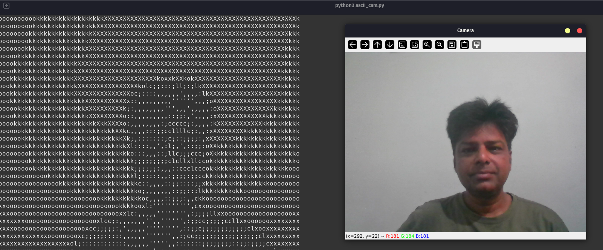
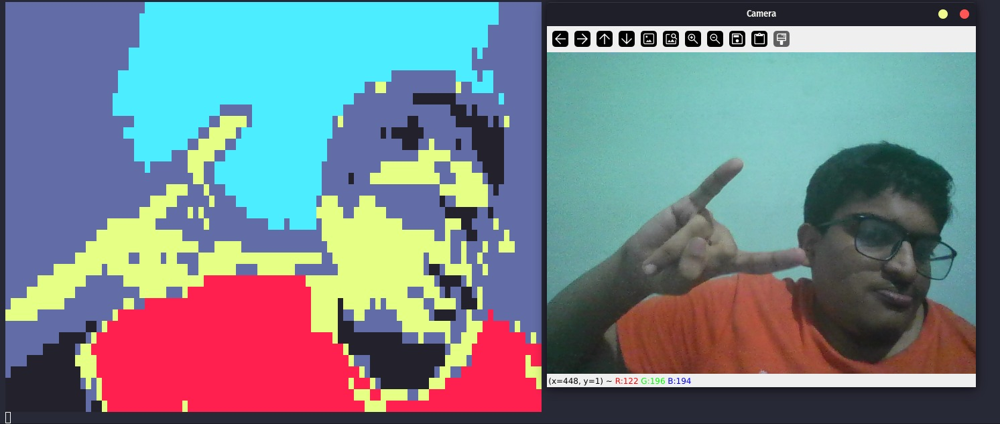

# 🎥 ASCII Camera Feed

A terminal-based camera display using ASCII characters — supports both black & white gradient mode and color mode using custom characters.

---

## 📸 Demo

### Black & White ASCII Mode


### Color ASCII Mode


---

## 🚀 Features

- Live webcam feed in ASCII
- Black & white mode with 4 gradient options
- Color mode with custom character rendering
- Frame rate control (`+` / `-`)
- Optionally toggle original webcam preview (`v`)
- Smooth terminal clearing and rendering

---

## 🗂️ Files Overview

| File           | Description |
|----------------|-------------|
| `ascii_cam.py` | 🔴 **Main script**: Live webcam ASCII renderer with real-time color & grayscale modes |
| `test_bw.py`   | 🖼️ Static image to **B/W ASCII art** using grayscale gradients |
| `test_col.py`  | 🎨 Static image to **colored ASCII art** using RGB to ANSI Fore color mapping |

---

## 🔧 How to Run

### 1. Install Dependencies
```bash
pip install -r requirements.txt
```

### 2. Run Live Camera ASCII
```bash
python ascii_cam.py
```

You'll be prompted to select:
- Color or Black & White mode
- Custom character (for color)
- Gradient set (for B/W)

Use these keys during runtime:

| Key | Action |
|-----|--------|
| `q` | Quit |
| `+` / `-` | Adjust delay (speed) |
| `v` | Toggle webcam preview |

### 3. Convert Static Image to ASCII
```bash
python test_bw.py
```
```bash
python test_col.py
```

📌 **Note:** Currently, `test_bw.py` and `test_col.py` use a sample image hardcoded in the script. You can replace the path manually for now. Support for custom paths will be added in the next version.

---

## 🤝 Contributing

Contributions are welcome! If you have ideas to improve the project — whether it's a bug fix, new feature, or a cool optimization — feel free to share.

### To Contribute:

1. Fork the repository
2. Clone your fork
   ```bash
   git clone https://github.com/your-username/ascii_cam.git
   ```
3. Create a new branch
   ```bash
   git checkout -b your-feature-name
   ```
4. Make your changes 🚀
5. Commit and push
   ```bash
   git add .
   git commit -m "Add: your awesome feature"
   git push origin your-feature-name
   ```
6. Open a Pull Request on the main repo

Please make sure your code is clean and documented. If you're adding something major, open an issue first so we can discuss it.

---

## 🧪 Suggestions for Contribution Ideas

- Add CLI image path input support to `test_bw.py` / `test_col.py`
- Add `.txt` export support for ASCII frames
- Add a GIF recorder mode (ASCII to animated `.txt`)
- Add TUI (Terminal UI) with options for real-time settings
- Implement different ASCII character sets for various styles
- Add support for different image formats
- Create configuration file support for default settings
- Add performance optimizations for larger terminal windows

---

## 📋 Requirements

Create a `requirements.txt` file with:
```
opencv-python
numpy
colorama
pillow
```

---

## 🎮 Usage Examples

### Basic Usage
```bash
# Start with default settings
python ascii_cam.py

# Convert a static image to B/W ASCII
python test_bw.py

# Convert a static image to colored ASCII
python test_col.py
```

### Runtime Controls
- Press `+` to increase frame rate (decrease delay)
- Press `-` to decrease frame rate (increase delay)
- Press `v` to toggle the original webcam preview window
- Press `q` to quit the application

---

## 🐛 Troubleshooting

**Camera not detected:**
- Make sure your webcam is not being used by another application
- Try running with administrator/sudo privileges
- Check if OpenCV can access your camera device

**Performance issues:**
- Reduce terminal window size for better performance
- Use the frame rate controls (`+`/`-`) to adjust speed
- Close other applications that might be using system resources

---

## 📄 License

This project is open source. Feel free to use, modify, and distribute as needed.

---

## 🙏 Acknowledgments

- OpenCV for camera capture functionality
- Colorama for terminal color support
- The ASCII art community for inspiration
